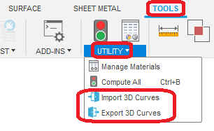
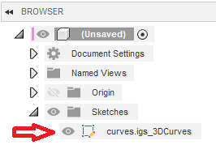
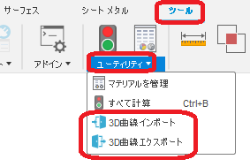
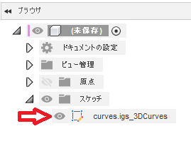

# **_Fusion360 Curve3D Doorway_**

This is an add-in for the Autodesk software "Fusion360".

It provides import and export functions for 3D curves.

---

## Installation :

To install, download/extract the zip file and register the "Two-turn_Mobius_strip" folder as an add-in.

To register an add-in,Please follow the instructions [here](https://knowledge.autodesk.com/support/fusion-360/troubleshooting/caas/sfdcarticles/sfdcarticles/How-to-install-an-ADD-IN-and-Script-in-Fusion-360.html).

## Usage :

- Launch the add-in. In the "Tools" tab, within "Utilities", the "Import 3D Curves" and "Export 3D Curves" commands will be added.

  

### 〇 Import (Windows only)

- After executing the "Import 3D Curves" command, a dialog box to open a file will appear. Select a file of your choice.

- Supported Formats

  - Iges
  - Step
  - Brep(OpenCASCADE Native Format)

- The elements that can be imported are lines, arcs, splines (Nurbs curves), and points. Ellipses are not eligible.

- After importing, a sketch with the name <file name> + "\_3DCurves" will be created.

  

- An error will occur if the file name contains double-byte characters.

- Attribute information (thickness, color, line type, etc.) as layers and lines will be ignored.

### 〇 Export (Windows・Mac)

- After executing the "Export 3D Curves" command, the Save File dialog will appear. Enter a file name of your choice and select a format.

  - Iges
  - Step
  - Sat

- The exported elements are the lines, arcs, and splines (Nurbs curves) of the displayed sketch, not the elements that are constructions.　 Ellipses will be treated as splines.

## Action :

Confirmed in the following environment.

- Fusion360 Ver2.0.10253
- Windows10 64bit Pro , Home

## License :

MIT

## Acknowledgments :

- The import function uses the 3D geometry library "siren".
  We would like to express our deepest gratitude to the developer, Mr. dyama.

  https://github.com/dyama/mruby-siren

- Thank you everyone in the [Japanese forum.](https://forums.autodesk.com/t5/fusion-360-ri-ben-yu/bd-p/707)

---

---

以下、日本語です。

これは、オートデスクソフトウェア「Fusion360」のアドインです。

3D 曲線のインポート・エクスポート機能を提供します。

---

## インストール :

インストールする際は、zip ファイルをダウンロード/展開後 "Curve3DDoorway" フォルダをアドインとして登録してください。

アドインの登録は、[こちら](https://kantoku.hatenablog.com/entry/2021/02/15/161734)の手順に従ってください。

## 使用法 :

- アドインを起動。"ツール" タブの "ユーティリティ" 内に "3D 曲線インポート" "3D 曲線エクスポート" コマンドが追加されます。

  

### 〇インポート (Windows のみ)

- "3D 曲線インポート" コマンドを実行後、ファイルを開くダイアログが表示されます。任意のファイルを選択してください。

- 対応フォーマット

  - Iges
  - Step
  - Brep(OpenCASCADE ネイティブフォーマット)

- インポートの対象となる要素は、直線・円弧・スプライン(Nurbs 曲線)・点です。楕円は対象外です。

- インポート後は <ファイル名> + "\_3DCurves" の名称のスケッチが作成されます。
  

- ファイル名に全角文字が含まれている場合、エラーとなります。

- レイヤや線としての属性情報（太さ・色・線種等）は無視されます。

### 〇エクスポート(Windows・Mac)

- "3D 曲線エクスポート" コマンドを実行後、ファイルを保存ダイアログが表示されます。任意のファイル名を入力し、フォーマットを選択してください。

  - Iges
  - Step
  - Sat

- エクスポートの対象となる要素は、表示されているスケッチの直線・円弧・スプライン(Nurbs 曲線)で、コンストラクションとなっている要素は対象外です。　又、楕円はスプラインとして処理されます。

## アクション :

以下の環境で確認しています。

- Fusion360 Ver2.0.10253
- Windows10 64bit Pro , Home

## ライセンス :

MIT

## 謝辞 :

- インポート機能は 3 次元幾何ライブラリー "siren" を使用しています。
  開発者の dyama 氏には、深く感謝いたします。

  https://github.com/dyama/mruby-siren

- [日本語フォーラム](https://forums.autodesk.com/t5/fusion-360-ri-ben-yu/bd-p/707)の皆さん、ありがとう。
- 上記の英語で不適切な部分をして頂けると助かります。
